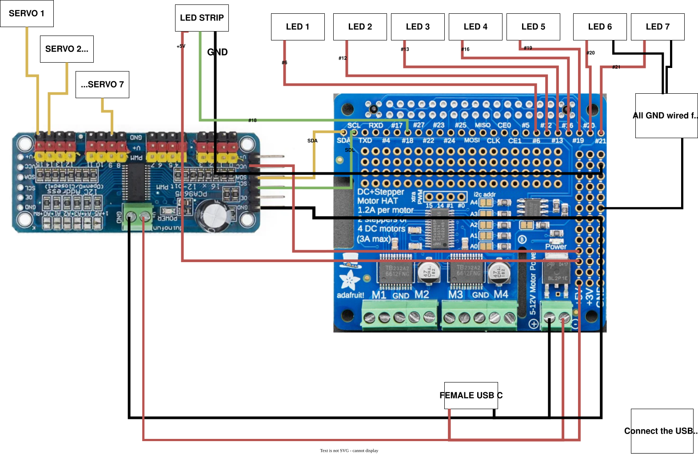

# Stargate Hardware Revision — PCA9685 + Servo Chevrons

Hardware revision by **XinuX** — replaces the two Adafruit Motor HATs with a PCA9685PW servo controller board, converting all 7 chevron actuators from DC motors to 180° servo motors.

## Motivation

The original design used a Raspberry Pi 3B+ with two Adafruit Motor HATs. This revision targets the **Raspberry Pi Zero 2W**, which cuts cost and power consumption significantly while keeping full software compatibility.

**Goals:**
- Run on Raspberry Pi Zero 2W (512 MB RAM, lower cost)
- Replace DC motor chevrons with cheap, quiet SG90/MG90S servos
- Eliminate the need for a second motor HAT
- Keep the wiring simple — servos connect directly to the PCA9685 3-pin headers

## Hardware Changes

### PCA9685PW — I2C PWM Servo Controller
- Controls up to 16 PWM channels over I2C (`0x40`)
- Drives all 7 chevron servos directly (no extra wiring adapters needed)
- Can also control chevron LEDs with minor modifications

### MG90S Servos (180°)
- Very affordable. Recommended: **metal gear / plastic internal gearing** variants — quieter operation and longer lifespan than all-plastic versions
- One servo per chevron (7 total)

### Speakers
- Inexpensive speakers redesigned into the base. See BOM link below.

### STL Files
Servo mounts and chevron holders are included in the `3dfiles/` directory.

## Bill of Materials

| Component | Link |
|---|---|
| Speakers | [AliExpress](https://es.aliexpress.com/item/1005008557986158.html) |
| PCA9685PW Servo Board | [AliExpress](https://es.aliexpress.com/item/1005006298833960.html) |
| USB Sound Card | [AliExpress](https://es.aliexpress.com/item/1005007108476482.html) |
| Micro USB to USB-A 90° | [AliExpress](https://es.aliexpress.com/item/1005006369042526.html) |
| MG90S 180° Servos | [AliExpress](https://es.aliexpress.com/item/1005006918547968.html) |
| 5V 5A Power Supply (USB-C) | [AliExpress](https://es.aliexpress.com/item/1005009043099128.html) |
| Micro USB Male Connector | [AliExpress](https://es.aliexpress.com/item/1005004410778655.html) |
| Female JST 2.54 wires 10cm | [AliExpress](https://es.aliexpress.com/item/1005006060326696.html) |

> **Power supply note:** The USB-C cable listed above carries both data and power — for this build, only the power lines are used.

## Wiring Diagram

